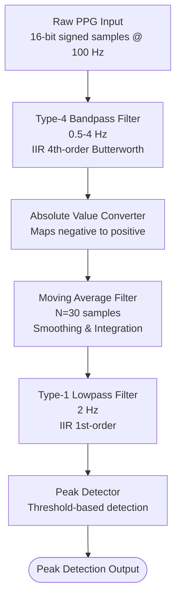

# Peak Detection of PPG Signals Using Fixed-Point Digital Filters Implemented in VHDL
This project implements a low latency, hardware-accelerated peak detection system for Photoplethysmography (PPG) signals. Developed as part of the CS4363 - Hardware Description Languages module at the University of Moratuwa, the system addresses the critical need for real-time physiological monitoring with minimal latency and high energy efficiency.

## Overview
Photoplethysmography (PPG) is a non-invasive optical technique used to detect blood volume changes in microvascular tissue, serving as the basis for monitoring heart rate, heart rate variability (HRV), and oxygen saturation ($SpO_2$).

While traditional software-based processing can introduce significant computational delays, this implementation utilizes the parallel processing power of a Xilinx Basys3 FPGA. By moving the signal processing to dedicated hardware logic, the system achieves deterministic, real-time performance, ensuring data privacy and robust monitoring at the edge.

> [!TIP]
> Want to more details ? Check out the [Wiki](https://github.com/EML-Labs/PPG-Peak-Detection-on-FPGA/wiki)

## Key Features

- Real-time I2C Interfacing - Custom master implementation for high-speed communication with the MAX30102 sensor, handling raw 18-bit data packets.

- Hardware-Efficient DSP - 4th-order Butterworth Bandpass and 1st-order Low-pass filters optimized using Direct Form II Transposed structures to minimize DSP slice utilization.

- Recursive Running Sum - A high-efficiency Moving Average filter implementation using a 30-sample window with a circular buffer.
- Fixed-Point Optimization - Optimized arithmetic utilizing $Qn.m$ format to maximize performance while maintaining a tiny resource footprint.

---

## System Architecture

The complete PPG peak detection system is organized as a modular pipeline:



---

##  Getting Started

### Setup the HDL compiler and GTKWave
> [!NOTE]
> Use the documentation provided in [here](https://github.com/EML-Labs/PPG-Peak-Detection-on-FPGA/wiki/Setup-Development-Environment)

### Setup a module with predefined structure
> [!TIP]
> Use the [Template Project](./../src/Template_Project/) with the documentation provided in [here](https://github.com/EML-Labs/PPG-Peak-Detection-on-FPGA/wiki/Setup-a-Module)

---

## Project Structure
```
.
├── aseets
├── data
│   ├── local
│   └── mimic
├── docs
├── examples
│   └── demo_example
├── include
│   └── python3.13
├── reports
├── scripts
├── simulation
├── src
│   ├── components
│   │   ├── absolute_value
│   │   ├── moving_average_filter
│   │   ├── peak_detector
│   │   ├── template_component
│   │   ├── type_1_lowpass_filter
│   │   └── type_4_bandpass_filter
│   ├── externals
│   │   └── i2c
│   └── pipeline
├── utils
└── validation
    ├── pipeline
    └── unit
        ├── absolute_value
        ├── moving_average_filter
        ├── type_1_lowpass_filter
        └── type_4_bandpass_filter
```

- [src/](./../src/): Core VHDL implementations.

- [components/](./../src/components/): Individual DSP modules (Filters, Moving Average, Rectifier, Peak Detector).

- [pipeline/](./../src/pipeline/): Top-level integration of the signal processing chain.

- [externals/](./../src/externals/): I2C master and sensor interface logic.
- [validation/](./../validation/): Test environment for end-to-end pipeline verification using the MIMIC PERform AF dataset.

- [simulation/](./../simulation/): Python-based reference implementation used for numerical verification and RMSE cross-validation.

## Testing Strategy

- Unit Testing - Functional blocks verified using VHDL testbenches in GHDL.

- Integration Testing - Complete transaction flow validated against realistic software models.

- Hardware Validation - Physical testing on Basys3 board with real-time signal observation via Raspberry Pi Pico.

---
## Acknowledgements

The I2C Master module used in this project is adapted from the work of [I2C Master](https://github.com/aslak3/i2c-controller) by [Lawrence Manning](https://www.aslak.net/).

## Citation
If you use this work in your research, please cite the following paper:
```bibtex
@inproceedings{niroshana2025ppg,
  title     = {Peak detection of {PPG} signals using fixed-point digital filters implemented in {VHDL}},
  author    = {Niroshana, H. K. Y. and Wimalasiri, W. M. and Hettiarachchi, C.},
  booktitle = {Proceedings of the Engineering Research Unit (ERU) Conference},
  year      = {2025},
  publisher = {Engineering Research Unit, University of Moratuwa},
  doi       = {10.31705/ERU.2025.38},
  url       = {https://dl.lib.uom.lk/items/73c999d1-3082-4812-94ae-30e70bf6d68a}
}
```

## License
This project is licensed under the CC BY 4.0 - see the [LICENSE](./../LICENSE) file for details.
